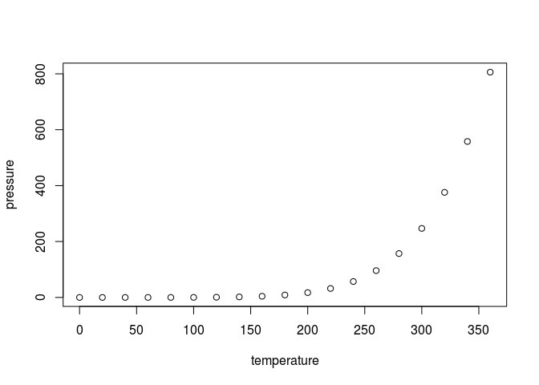

manuscript
================
Jakob

*[Edit this document or send a commented pull request.](https://github.com/jgoldmann/collaborativeRmdManuscript/edit/master/Readme.Rmd)*

R Markdown
----------

This is an R Markdown document. Markdown is a simple formatting syntax for authoring HTML, PDF, and MS Word documents. For more details on using R Markdown see <http://rmarkdown.rstudio.com>.

When you click the **Knit** button a document will be generated that includes both content as well as the output of any embedded R code chunks within the document. You can embed an R code chunk like this:

``` r
summary(cars)
```

    ##      speed           dist       
    ##  Min.   : 4.0   Min.   :  2.00  
    ##  1st Qu.:12.0   1st Qu.: 26.00  
    ##  Median :15.0   Median : 36.00  
    ##  Mean   :15.4   Mean   : 42.98  
    ##  3rd Qu.:19.0   3rd Qu.: 56.00  
    ##  Max.   :25.0   Max.   :120.00

Including Plots
---------------

You can also embed plots, for example:



Including Table
---------------

|  temperature|  pressure|
|------------:|---------:|
|            0|    0.0002|
|           20|    0.0012|
|           40|    0.0060|
|           60|    0.0300|
|           80|    0.0900|
|          100|    0.2700|
|          120|    0.7500|
|          140|    1.8500|
|          160|    4.2000|
|          180|    8.8000|
|          200|   17.3000|
|          220|   32.1000|
|          240|   57.0000|
|          260|   96.0000|
|          280|  157.0000|
|          300|  247.0000|
|          320|  376.0000|
|          340|  558.0000|
|          360|  806.0000|

Inline Numbers
--------------

Let's see what some inline numbers will look like: There are 50 cars.
